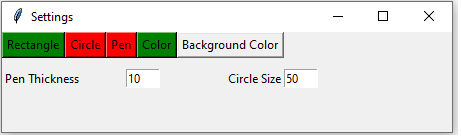
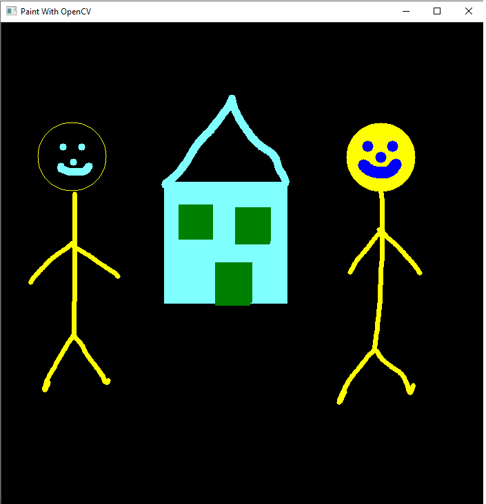
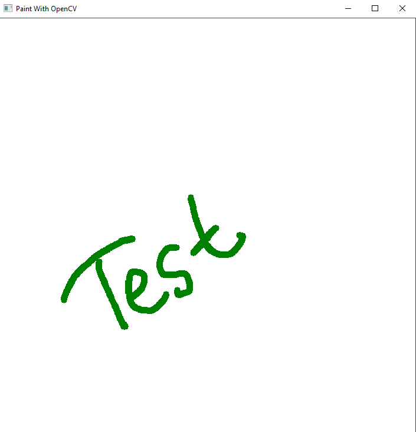

# Drawing-With-OpenCV
Basic drawing operations with opencv library.

# Libraries
- cv2
- numpy 
- threading
- tkinter
- pyautogui

# Description
This program displays a screen for drawing and opens the settings window to change the drawing style.
From the settings window, you can change the drawing style like putting a circle, drawing a rectangle or drawing manually.
Furthermore, you can change the drawing color and resize the manual drawing thickness and size of the circle. 
Lastly, the background color button clears the screen and change to white or black.

## Settings Window

  

## Main Screen Examples
  
  
  
